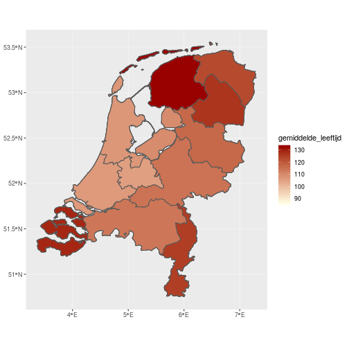
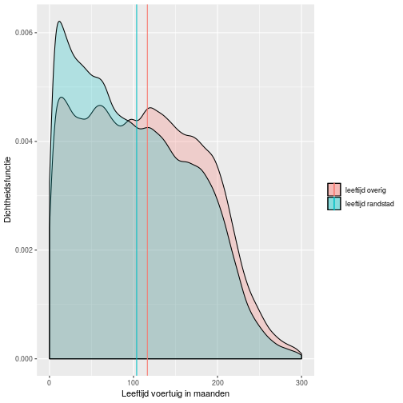
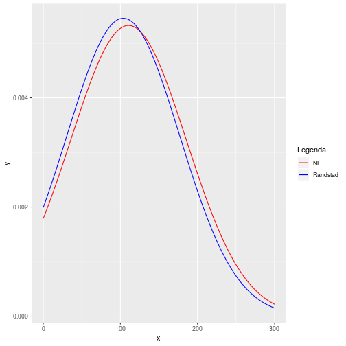

<!-- # Is de stijgende welvaart/economie ook te zien in de BRON Dataset -->
#Is de randstad welvarender dan de rest van Nederland
========================================================

author: Romano Londt  
date: 08-01-2019  

========================================================


```
Reading layer `NLD_adm1' from data source `/home/rstudio/mba/DataAnalyseWithR/datafiles/NLD_adm/NLD_adm1.shp' using driver `ESRI Shapefile'
Simple feature collection with 14 features and 9 fields
geometry type:  MULTIPOLYGON
dimension:      XY
bbox:           xmin: 3.360782 ymin: 50.75517 xmax: 7.29271 ymax: 53.55458
epsg (SRID):    4326
proj4string:    +proj=longlat +datum=WGS84 +no_defs
```

```
Cannot open data source ./datafiles/NLD_adm/NLD_adm1.shp
```


Verkennend onderzoek
========================================================
**Wat is de statistische verdeling van de leeftijd**  


```r
ggplot(df_explorative, aes(x=leeftijd_voertuig)) + 
  geom_histogram(bins = 30, aes(fill=jaar_factor))+
  facet_wrap(~jaar_factor,ncol = 3)
```


***Poisson, behandelen als normale verdeling gezien de aantallen***  
****Spreiding wordt wel steeds groter****  

Verkennend onderzoek: is er onderscheid per provincie
========================================================


```r
df_prov <- df_explorative %>%
  group_by(jaar_integer, PVE_NAAM) %>%
  summarise(gemiddelde_leeftijd = mean(leeftijd_voertuig))
  
df_prov <- right_join(nld.1, df_prov, by = c("NAME_1" = "PVE_NAAM"))

ggplot(data = df_prov) +
  geom_sf(aes(fill = gemiddelde_leeftijd))+
  scale_fill_gradient(low = "#ffffe6", high = "#990000")+
  facet_wrap(~jaar_integer,ncol = 3)
```

Verkennend onderzoek: is er onderscheid per provincie
========================================================



**Er is verschil tussen de provincies**


Vraagstelling
========================================================
**Is de populatie binnen de randstad welvarender dan de rest van Nederland?**  

Operationalisatie(1)
========================================================
**Randstad**  
- Provincies 
  - Zuid-Holland
  - Noord-Holland
  - Utrecht  

**Welvarender**
- Hebben gemiddeld jongere voertuigen


Operationalisatie(2)
========================================================
- h0 :  
  - gemiddelde leeftijd van de voertuigen betrokken is gelijk verdeeld over Nederland
- h1 :  
  - gemiddelde leeftijd van de voertuigen betrokken is in de randstad lager

Toetsen door middel van One sample T-Test
- Eenzijdig toetsen
- Alternative = less

Bewerking dataset
========================================================

```r
randstad <- c("Zuid-Holland", "Noord-Holland", "Utrecht")
df_randstad <- df_leeftijd  %>%
  mutate(randstad = PVE_NAAM %in% randstad) %>%
  filter(randstad==TRUE)

data.frame(categorie=c("Leeftijd NL","Leeftijd Randstad")
, gemiddelde=c(mean(df_leeftijd$leeftijd_voertuig), mean(df_randstad$leeftijd_voertuig))
, stddev=c(sd(df_leeftijd$leeftijd_voertuig), sd(df_randstad$leeftijd_voertuig)))
```

```
          categorie gemiddelde   stddev
1       Leeftijd NL  100.74396 70.09028
2 Leeftijd Randstad   95.56343 69.12763
```

Beantwoording Visueel
========================================================

```r
ggplot()+
  geom_density(data=df_leeftijd, aes(x=leeftijd_voertuig, fill=1), alpha=0.25)+
  geom_density(data=df_randstad, aes(x=leeftijd_voertuig, fill=2), alpha=0.25)+
  geom_vline(aes(xintercept = mean(df_leeftijd$leeftijd_voertuig), color="leeftijd-totaal"))+
  geom_vline(aes(xintercept = mean(df_randstad$leeftijd_voertuig), color="leeftijd-randstad"))
```

Beantwoording Visueel
========================================================



Beantwoording Visueel
========================================================

```r
ggplot(NULL, aes(x, colour= Legenda)) + 
  stat_function(data = data.frame(x = 0:600, Legenda=factor(1)), fun = dnorm, args = list(mean = mean(df_leeftijd$leeftijd_voertuig), sd = sd(df_leeftijd$leeftijd_voertuig))) +
  stat_function(data = data.frame(x = 0:600, Legenda=factor(2)), fun = dnorm, args = list(mean = mean(df_randstad$leeftijd_voertuig), sd = sd(df_randstad$leeftijd_voertuig))) +
  scale_colour_manual(values = c("red", "blue"), labels = c("NL", "Randstad"))
```

Beantwoording Visueel
========================================================



Beantwoording Statistisch
========================================================


```r
t.test(df_randstad$leeftijd_voertuig, mu=mean(df_leeftijd$leeftijd_voertuig), alternative = "less", conf.level = 0.95)
```

```

	One Sample t-test

data:  df_randstad$leeftijd_voertuig
t = -23.683, df = 99871, p-value < 2.2e-16
alternative hypothesis: true mean is less than 100.744
95 percent confidence interval:
     -Inf 95.92323
sample estimates:
mean of x 
 95.56343 
```


Conclusie
========================================================

**Op basis van de BRON dataset is te herleiden dat voertuigen in de randstad gemiddeld jonger zijn dan in de rest van Nederland. Hieruit kan worden afgeleid dat de Randstad welvarender is dan de rest van het land.**  


<!-- Vraagstelling -->
<!-- ======================================================== -->
<!-- **Is de stijgende economie terug te vinden in de BRON dataset**   -->
<!-- - Economie stijgt   -->
<!--   - mensen kopen een andere nieuwere auto    -->
<!-- - Leeftijd van de auto is onafhankelijke variabele ten opzichte van het krijgen van een ongeluk(aanname)    -->

<!-- Operationalisatie(1) -->
<!-- ======================================================== -->
<!-- - h0 :   -->
<!--   - gemiddelde leeftijd van de voertuigen betrokken bij ongelukken blijft gelijk -->
<!-- - h1 :   -->
<!--   - gemiddelde leeftijd van de voertuigen betrokken bij ongelukken stijgt -->


<!-- Antwoord - visueel (1) -->
<!-- ======================================================== -->
<!-- ```{r eval=FALSE, include=TRUE} -->
<!-- df_hyp <- df_leeftijd   -->

<!-- df_hyp %>% -->
<!--   group_by(jaar_factor) %>% -->
<!--   summarise(gemiddelde_leeftijd = mean(leeftijd_voertuig) -->
<!--            ,variantie_leeftijd = var(leeftijd_voertuig)) -->

<!-- ggplot(df_hyp, aes(x=jaar_factor, y=leeftijd_voertuig)) +  -->
<!--   geom_boxplot(aes(group=jaar_factor))+ -->
<!--   scale_y_continuous("leeftijd van de voertuigen in maanden", labels = comma) + -->
<!--   scale_x_discrete("jaartal", breaks=c(2005:2018), labels=c(2005:2018) ) -->

<!-- ```   -->

<!-- Antwoord - visueel (1) -->
<!-- ======================================================== -->
<!-- ```{r eval=TRUE, echo=FALSE} -->

<!-- df_hyp <- df_leeftijd   -->

<!-- df_hyp %>% -->
<!--   group_by(jaar_factor) %>% -->
<!--   summarise(gemiddelde_leeftijd = mean(leeftijd_voertuig) -->
<!--            ,variantie_leeftijd = var(leeftijd_voertuig)) -->

<!-- ggplot(df_hyp, aes(x=jaar_factor, y=leeftijd_voertuig)) +  -->
<!--   geom_boxplot(aes(group=jaar_factor))+ -->
<!--   scale_y_continuous("leeftijd van de voertuigen in maanden", labels = comma) + -->
<!--   scale_x_discrete("jaartal", breaks=c(2005:2018), labels=c(2005:2018) ) -->


<!-- ```   -->
<!-- - stijging zichtbaar in de laatste twee jaren    -->
<!-- - **Geen bewijs voor de stelling**  -->


<!-- Antwoord - statistisch -->
<!-- ======================================================== -->
<!-- Jaartallen vergelijken  -->
<!--   - meerdere jaartallen(groepen) -->
<!--   - beoordelen of de gemiddelden van deze groepen significant van elkaar afwijken -->
<!-- - **ANOVA** -->

<!-- ```{r eval=FALSE, include=TRUE} -->
<!-- df_aov <- df_hyp %>% -->
<!--   filter(jaar_integer >= 2004 ) -->

<!-- # Compute the analysis of variance -->
<!-- res.aov <- aov(leeftijd_voertuig ~ jaar_factor, data = df_aov) -->
<!-- summary(res.aov) -->

<!-- ```   -->


<!-- Antwoord - statistisch -->
<!-- ======================================================== -->
<!-- Jaartallen vergelijken  -->
<!--   - ANOVA + Tukey -->
<!--   - <http://www.sthda.com/english/wiki/one-way-anova-test-in-r> -->

<!-- ```{r echo=FALSE} -->
<!-- df_aov <- df_hyp %>% -->
<!--   filter(jaar_integer >= 2004 ) -->

<!-- # Compute the analysis of variance -->
<!-- res.aov <- aov(leeftijd_voertuig ~ jaar_factor, data = df_aov) -->
<!-- summary(res.aov) -->


<!-- TukeyHSD(res.aov, ordered = FALSE) -->
<!-- ```   -->

<!-- **Significant verschil tussen groepen(jaren)**   -->

<!-- Antwoord - statistisch -->
<!-- ======================================================== -->
<!-- ```{r echo=FALSE} -->
<!--  plot(TukeyHSD(res.aov, ordered = FALSE)) -->
<!-- ```   -->

<!-- **Verschil leeftijd van voertuigen die bij ongelukken betrokken zijn wordt hoger**   -->


<!-- Toetsen -->
<!-- ======================================================== -->

<!-- ```{r} -->
<!-- df_aov <- df_hyp  -->

<!-- df_hyp%>% -->
<!--   group_by(PVE_NAAM)%>% -->
<!--   summarise(gemiddelde = mean(leeftijd_voertuig)) -->

<!-- # Compute the analysis of variance -->
<!-- res.aov <- aov(leeftijd_voertuig ~ PVE_NAAM, data = df_aov) -->
<!-- summary(res.aov) -->


<!-- TukeyHSD(res.aov, ordered = TRUE) -->

<!-- ``` -->


<!-- Conclusie -->
<!-- ======================================================== -->

<!-- **Op basis van de BRON dataset is te herleiden dat voertuigen met een grotere footprint de afgelopen jaren significant meer bij ongevallen betrokken zijn geweest bij ongelukken in 30 km-zones binnen de bebouwde kom vergeleken met eerdere jaartallen.**   -->

