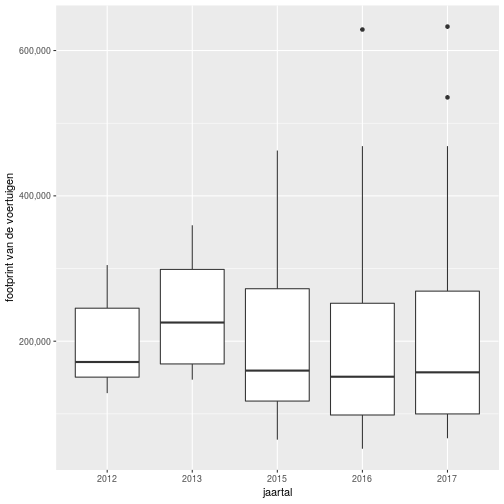
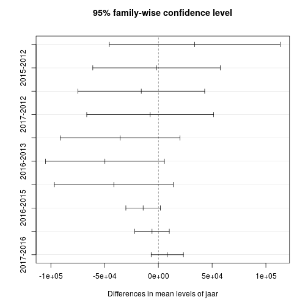

# Factcheck pakketbezorgers veroorzaken onveilige situaties 
========================================================

author: Romano Londt  
date: 06-01-2019  


Inhoud
========================================================
- Dataset
- Vraagstelling
- Operationalisatie
- Verdieping
- Conclusie

Dataset
========================================================
- Voorbewerking  
-- Explorative analysis (Verkennend onderzoek)  
-- Shiny  


Plot - Diagram aantallen ongevallen per maand
========================================================


Vraagstelling
========================================================
##  bericht op NOS(24-12-2019)  

<https://nos.nl/artikel/2264908-pakketbezorgers-veroorzaken-onveilige-verkeerssituaties.html>


Operationalisatie(1)
========================================================
- hoe herkennen we pakketbezorgers?
  - footprint van de voertuigen is groter dan normale auto's  
  - als er meer ongevallen gebeuren met pakketbezorgers zal de gemiddelde footprint stijgen  
- 30 kilometer zone's 
  - maximum snelheid = 30  
  - binnen de bebouwde kom  

Operationalisatie(2)
========================================================
- h0 :  
  - footprint van de voertuigen die ongelukken veroorzaken binnen de bebouwde kom waar een maximumsnelheid geld is de afgelopen jaren gelijk gebleven
- h1 :  
  - footprint van de voertuigen die ongelukken veroorzaken binnen de bebouwde kom waar een maximumsnelheid geld is de afgelopen jaren groter geworden


Antwoord - visueel (1)
========================================================


```r
df_hyp <- df_totaal %>%
  filter(!is.na(BREEDTE) & !is.na(LENGTE)) %>%
  mutate(footprint = BREEDTE*LENGTE ) %>%
  mutate(jaar = year(DATUM))

ggplot(df_hyp, aes(x=jaar, y=footprint)) + 
  geom_boxplot(aes(group=jaar))+
  scale_y_continuous("footprint van de voertuigen", labels = comma) +
  scale_x_discrete("jaartal", breaks=c(2005:2018), labels=c(2005:2018) )
```

Antwoord - visueel (1)
========================================================

- daling zichtbaar in de laatste twee jaren ten opzichte van de rest van de historie  

- **Geen bewijs voor de stelling** 


Antwoord - statistisch
========================================================
Jaartallen vergelijken 
  - meerdere jaartallen(groepen)
  - beoordelen of de gemiddelden van deze groepen significant van elkaar afwijken
- **ANOVA**


```r
df_aov <- df_hyp %>%
  mutate(jaar2 = as.integer(year(DATUM))) %>%
  filter(jaar2 >= 2010 )

# Compute the analysis of variance
res.aov <- aov(footprint ~ jaar, data = df_aov)
summary(res.aov)
```


Antwoord - statistisch
========================================================
Jaartallen vergelijken 
  - ANOVA + Tukey
  - <http://www.sthda.com/english/wiki/one-way-anova-test-in-r>


```
              Df    Sum Sq   Mean Sq F value Pr(>F)  
jaar           4 1.016e+11 2.540e+10   2.678 0.0303 *
Residuals   1782 1.690e+13 9.483e+09                 
---
Signif. codes:  0 '***' 0.001 '**' 0.01 '*' 0.05 '.' 0.1 ' ' 1
```
**Significant verschil tussen groepen(jaren)**  
  
  
Antwoord - statistisch
========================================================
- kolom diff laat het verschil zien tussen twee jaren (positief = grotere footprint voor het eerste
  jaartal)  
- **Laatste jaren is de footprint juist gedaald => verwerpen hypothese**  

```
  Tukey multiple comparisons of means
    95% family-wise confidence level

Fit: aov(formula = footprint ~ jaar, data = df_aov)

$jaar
                diff         lwr        upr     p adj
2013-2012  33800.863  -45652.194 113253.920 0.7732578
2015-2012  -1739.344  -61004.007  57525.319 0.9999907
2016-2012 -15913.914  -74900.397  43072.569 0.9479088
2017-2012  -7631.658  -66618.141  51354.825 0.9966664
2015-2013 -35540.207  -91140.996  20060.582 0.4063155
2016-2013 -49714.777 -105018.960   5589.405 0.1016702
2017-2013 -41432.521  -96736.704  13871.662 0.2446757
2016-2015 -14174.570  -30238.961   1889.821 0.1132132
2017-2015  -5892.314  -21956.705  10172.077 0.8547292
2017-2016   8282.256   -6723.393  23287.906 0.5579362
```
**H0 hypothese verworpen maar niet de juiste richting op**

Antwoord - statistisch
========================================================



Verdieping
========================================================
- kunnen we zomaar de gemiddelden met elkaar vergelijken? 
- is de verdeling normaal?


```r
ggplot(df_hyp)+
  aes(x=footprint)+
  geom_histogram(bins=50)
```


Verdieping
========================================================
- kunnen we zomaar de gemiddelden met elkaar vergelijken? 
- is de verdeling normaal?


- **Nee** , Anova gaat uit van een normale verdeling


Verdieping (2) - clusteren van footprints
========================================================
- footprints clusteren om zo een cluster te maken van grote voertuigen (pakketbezorgerbusjes)
- algoritme k-means clustering
-- hoeveel clusters? **Elbow-method**


```r
df_cluster <- df_hyp %>%
  ungroup()%>%
  select(footprint) 
 
df_scaled <- scale(df_cluster)    
k.max <- 10
wss <- sapply(1:k.max, function(k)
   kmeans(x = df_scaled, centers = k, nstart = 10)$tot.withinss
)

df_results <- data.frame(k = 1:k.max, within_sum_square = wss)

ggplot(df_results) +
  geom_line(aes(x = k, y = within_sum_square)) + 
  geom_vline(xintercept = 4, linetype = "dashed")  
```

Verdieping (2) - clusteren van footprints
========================================================
- footprints clusteren om zo een cluster te maken van grote voertuigen (pakketbezorgerbusjes)
- algoritme k-means clustering
-- hoeveel clusters? **Elbow-method** =>  **4**


Verdieping (3) - uitvoeren van clustering
========================================================

** uitvoering van de clustering  

```r
K <- 4
k_means <- kmeans(x=df_scaled, centers = sort(kmeans(x=df_scaled, centers = K)$centers))

df_hyp$footprint_cluster <- as.factor(k_means$cluster)

ggplot(df_hyp)+
  aes(x=footprint, fill=footprint_cluster, color=footprint_cluster)+
  geom_bar()
```

Verdieping (3) - uitvoeren van clustering
========================================================

** uitvoering van de clustering  


Verdieping (4) - opnieuw valideren hypothese
========================================================
Jaartallen vergelijken 
* meerdere jaartallen(groepen)
* Chi-square op basis van aantallen in clusters i.p.v. gemiddelde footprint

```r
  table(df_hyp$jaar, df_hyp$footprint_cluster)
```

Verdieping (4) - opnieuw valideren hypothese
========================================================
Jaartallen vergelijken 
* meerdere jaartallen(groepen)
* Chi-square op basis van aantallen in clusters i.p.v. gemiddelde footprint

```
      
         1   2   3   4
  2012   0  12   6   3
  2013   0   8   8   8
  2015 132 139  98 117
  2016 235 166  96 131
  2017 213 156 119 140
```


Antwoord(2) - visueel 
========================================================


```r
df_hyp <- df_hyp %>%
  mutate(jaar_int = as.integer(jaar)) %>%
  ungroup()

ggplot(df_hyp) + 
  aes(x=jaar_int, color=footprint_cluster)+
  geom_line(stat="count")+
  scale_y_continuous("Aantal ongelukken", labels = comma) +
  scale_x_continuous("Jaartal", breaks=c(2005:2018), labels=c(2005:2018) )
```

Antwoord(2) - visueel 
========================================================

- stijging waarneembaar voor het cluster met grootste voertuigen
- **Wel bewijs voor de stelling** 


Antwoord(2) - statistisch
========================================================
- Chi-square op basis van aantal ongelukken per jaar


```r
df_aov2 <- df_hyp %>%
  filter(jaar_int >= 2010 )%>%
  filter(footprint_cluster == 4 )%>%
  mutate(jaar = as.factor(year(DATUM)))%>%
  group_by(jaar) %>%
  summarise(aantal = n())

c <- chisq.test(df_aov2$aantal)
c
c$observed
round(c$expected,2)
```
  
Antwoord(2) - statistisch
========================================================
  - Chi-square op basis van aantal ongelukken per jaar


```

	Chi-squared test for given probabilities

data:  df_aov2$aantal
X-squared = 234.12, df = 4, p-value < 2.2e-16
```

```
[1]   3   8 117 131 140
```

```
[1] 79.8 79.8 79.8 79.8 79.8
```
**Significant verschil tussen groepen(jaren)**  
**Duidelijke toename te zien in aantal ongevallen met voertuigen in de grootste categorie**  
  
  
Conclusie
========================================================

**Op basis van de BRON dataset is te herleiden dat voertuigen met een grotere footprint de afgelopen jaren significant meer bij ongevallen betrokken zijn geweest bij ongelukken in 30 km-zones binnen de bebouwde kom vergeleken met eerdere jaartallen.**  

