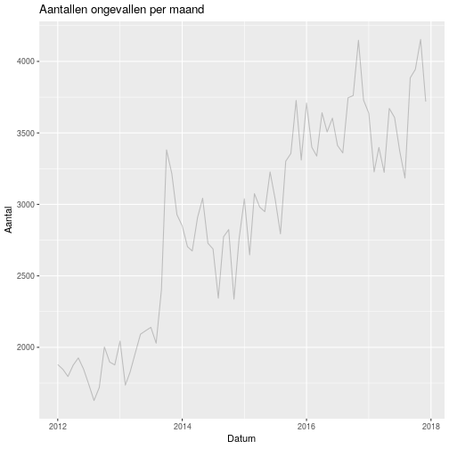
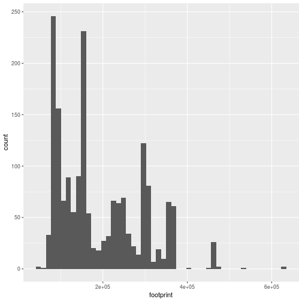

# Factcheck pakketbezorgers veroorzaken onveilige situaties 
========================================================

author: Romano Londt  
date: 06-01-2019  


Inhoud
========================================================
- Dataset
- Vraagstelling
- Operationalisatie
- Verdieping
- Conclusie

Dataset
========================================================
- Voorbewerking  
-- Explorative analysis (Verkennend onderzoek)  
-- Shiny  


Plot - Histogram aantallen ongevallen
========================================================


Vraagstelling
========================================================
##  bericht op NOS(24-12-2019)  

<https://nos.nl/artikel/2264908-pakketbezorgers-veroorzaken-onveilige-verkeerssituaties.html>


Operationalisatie(1)
========================================================
- hoe herkennen we pakketbezorgers?
  - footprint van de voertuigen is groter dan normale auto's  
  - als er meer ongevallen gebeuren met pakketbezorgers zal de gemiddelde footprint stijgen  
- 30 kilometer zone's 
  - maximum snelheid = 30  
  - binnen de bebouwde kom  

Operationalisatie(2)
========================================================
- h0 :  
  - footprint van de voertuigen die ongelukken veroorzaken binnen de bebouwde kom waar een maximumsnelheid geld is de afgelopen jaren gelijk gebleven
- h1 :  
  - footprint van de voertuigen die ongelukken veroorzaken binnen de bebouwde kom waar een maximumsnelheid geld is de afgelopen jaren groter geworden


Antwoord - visueel (1)
========================================================


```r
df_hyp <- df_totaal %>%
  filter(!is.na(BREEDTE) & !is.na(LENGTE)) %>%
  mutate(footprint = BREEDTE*LENGTE ) %>%
  mutate(jaar = year(DATUM))

ggplot(df_hyp, aes(x=jaar, y=footprint)) + 
  geom_boxplot(aes(group=jaar))+
  scale_y_continuous("footprint van de voertuigen", labels = comma) +
  scale_x_discrete("jaartal", breaks=c(2005:2018), labels=c(2005:2018) )
```

Antwoord - visueel (1)
========================================================

- daling zichtbaar in de laatste twee jaren ten opzichte van de rest van de historie  

- **Geen bewijs voor de stelling** 


Antwoord - statistisch
========================================================
Jaartallen vergelijken 
  - meerdere jaartallen(groepen)
  - beoordelen of de gemiddelden van deze groepen significant van elkaar afwijken
- **ANOVA**


```r
df_aov <- df_hyp %>%
  mutate(jaar2 = as.integer(year(DATUM))) %>%
  filter(jaar2 >= 2010 )

# Compute the analysis of variance
res.aov <- aov(footprint ~ jaar, data = df_aov)
summary(res.aov)
```


Antwoord - statistisch
========================================================
Jaartallen vergelijken 
  - ANOVA + Tukey
  - <http://www.sthda.com/english/wiki/one-way-anova-test-in-r>


```
              Df    Sum Sq   Mean Sq F value  Pr(>F)    
jaar           6 2.871e+11 4.785e+10   5.058 3.7e-05 ***
Residuals   1857 1.757e+13 9.459e+09                    
---
Signif. codes:  0 '***' 0.001 '**' 0.01 '*' 0.05 '.' 0.1 ' ' 1
```
**Significant verschil tussen groepen(jaren)**  
  
  
Antwoord - statistisch
========================================================
- kolom diff laat het verschil zien tussen twee jaren (positief = grotere footprint voor het eerste
  jaartal)  
- **Laatste jaren is de footprint juist gedaald => verwerpen hypothese**  

```
  Tukey multiple comparisons of means
    95% family-wise confidence level

Fit: aov(formula = footprint ~ jaar, data = df_aov)

$jaar
                 diff         lwr        upr     p adj
2011-2010 -59673.3056 -192435.037  73088.426 0.8395279
2012-2010 -43404.8770 -114599.038  27789.284 0.5485406
2013-2010  -9604.0139  -77265.658  58057.630 0.9995864
2015-2010 -45144.2212  -81394.513  -8893.929 0.0045572
2016-2010 -59318.7912  -95036.348 -23601.234 0.0000213
2017-2010 -51036.5349  -86754.092 -15318.978 0.0005155
2012-2011  16268.4286 -126578.472 159115.329 0.9998851
2013-2011  50069.2917  -91050.255 191188.838 0.9428552
2015-2011  14529.0844 -114508.554 143566.723 0.9998926
2016-2011    354.5143 -128534.478 129243.506 1.0000000
2017-2011   8636.7707 -120252.221 137525.763 0.9999950
2013-2012  33800.8631  -51975.926 119577.652 0.9078231
2015-2012  -1739.3442  -65720.929  62242.241 1.0000000
2016-2012 -15913.9142  -79595.178  47767.350 0.9902311
2017-2012  -7631.6579  -71312.922  56049.606 0.9998453
2015-2013 -35540.2073  -95566.307  24485.893 0.5839134
2016-2013 -49714.7773 -109420.664   9991.109 0.1756130
2017-2013 -41432.5210 -101138.407  18273.366 0.3845061
2016-2015 -14174.5700  -31517.539   3168.398 0.1938114
2017-2015  -5892.3137  -23235.282  11450.655 0.9534697
2017-2016   8282.2564   -7917.705  24482.217 0.7395413
```
**H0 hypothese verworpen maar niet de juiste richting op**

Antwoord - statistisch
========================================================


Verdieping
========================================================
- kunnen we zomaar de gemiddelden met elkaar vergelijken? 
- is de verdeling normaal?


```r
ggplot(df_hyp)+
  aes(x=footprint)+
  geom_histogram(bins=50)
```


Verdieping
========================================================
- kunnen we zomaar de gemiddelden met elkaar vergelijken? 
- is de verdeling normaal?



- **Nee** , Anova gaat uit van een normale verdeling


Verdieping (2) - clusteren van footprints
========================================================
- footprints clusteren om zo een cluster te maken van grote voertuigen (pakketbezorgerbusjes)
- algoritme k-means clustering
-- hoeveel clusters? **Elbow-method**


```r
df_cluster <- df_hyp %>%
  ungroup()%>%
  select(footprint) 
 
df_scaled <- scale(df_cluster)    
k.max <- 10
wss <- sapply(1:k.max, function(k)
   kmeans(x = df_scaled, centers = k, nstart = 10)$tot.withinss
)

df_results <- data.frame(k = 1:k.max, within_sum_square = wss)

ggplot(df_results) +
  geom_line(aes(x = k, y = within_sum_square)) + 
  geom_vline(xintercept = 4, linetype = "dashed")  
```

Verdieping (2) - clusteren van footprints
========================================================
- footprints clusteren om zo een cluster te maken van grote voertuigen (pakketbezorgerbusjes)
- algoritme k-means clustering
-- hoeveel clusters? **Elbow-method** =>  **4**


Verdieping (3) - uitvoeren van clustering
========================================================

** uitvoering van de clustering  

```r
K <- 4
k_means <- kmeans(x=df_scaled, centers = sort(kmeans(x=df_scaled, centers = K)$centers))

df_hyp$footprint_cluster <- as.factor(k_means$cluster)

ggplot(df_hyp)+
  aes(x=footprint, fill=footprint_cluster, color=footprint_cluster)+
  geom_bar()
```

Verdieping (3) - uitvoeren van clustering
========================================================

** uitvoering van de clustering  


Verdieping (4) - opnieuw valideren hypothese
========================================================
Jaartallen vergelijken 
* meerdere jaartallen(groepen)
* Chi-square op basis van aantallen in clusters i.p.v. gemiddelde footprint

```r
  table(df_hyp$jaar, df_hyp$footprint_cluster)
```

Verdieping (4) - opnieuw valideren hypothese
========================================================
Jaartallen vergelijken 
* meerdere jaartallen(groepen)
* Chi-square op basis van aantallen in clusters i.p.v. gemiddelde footprint

```
      
         1   2   3   4
  2006   4 184 176  94
  2007   4 230 177 110
  2008   5 219 187 126
  2009   5 132 118  89
  2010   0  24  24  24
  2011   0   4   0   1
  2012   0  12   6   3
  2013   0   8   8   8
  2015 138 133  96 119
  2016 237 164  92 135
  2017 217 152 114 145
```


Antwoord(2) - visueel 
========================================================


```r
df_hyp <- df_hyp %>%
  mutate(jaar_int = as.integer(jaar)) %>%
  ungroup()

ggplot(df_hyp) + 
  aes(x=jaar_int, color=footprint_cluster)+
  geom_line(stat="count")+
  scale_y_continuous("Aantal ongelukken", labels = comma) +
  scale_x_continuous("Jaartal", breaks=c(2005:2018), labels=c(2005:2018) )
```

Antwoord(2) - visueel 
========================================================

- stijging waarneembaar voor het cluster met grootste voertuigen
- **Wel bewijs voor de stelling** 


Antwoord(2) - statistisch
========================================================
- Chi-square op basis van aantal ongelukken per jaar


```r
df_aov2 <- df_hyp %>%
  filter(jaar_int >= 2010 )%>%
  filter(footprint_cluster == 4 )%>%
  mutate(jaar = as.factor(year(DATUM)))%>%
  group_by(jaar) %>%
  summarise(aantal = n())

c <- chisq.test(df_aov2$aantal)
c
c$observed
round(c$expected,2)
```
  
Antwoord(2) - statistisch
========================================================
  - Chi-square op basis van aantal ongelukken per jaar


```

	Chi-squared test for given probabilities

data:  df_aov2$aantal
X-squared = 434.95, df = 6, p-value < 2.2e-16
```

```
[1]  24   1   3   8 119 135 145
```

```
[1] 62.14 62.14 62.14 62.14 62.14 62.14 62.14
```
**Significant verschil tussen groepen(jaren)**  
**Duidelijke toename te zien in aantal ongevallen met voertuigen in de grootste categorie**  
  
  
Conclusie
========================================================

**Op basis van de BRON dataset is te herleiden dat voertuigen met een grotere footprint de afgelopen jaren significant meer bij ongevallen betrokken zijn geweest bij ongelukken in 30 km-zones binnen de bebouwde kom vergeleken met eerdere jaartallen.**  

